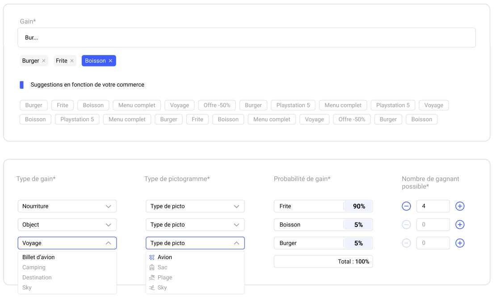

# tgc-interview-demo

The goal is simple : build one demo app and make an architecture diagram in 1H in a peer-programming session.

## The first app (45 min) : 
We have a mockup that we need to implement in a React + Vite project.  
We must use Typescript, MaterialUI and Tailwind.

  

## The architecture diagram (15 min) : 
  We need to find how to implement the following feature:
  > When a shop gives away a gift, it might need to call an external service for diverse reasons (stock update, fidelity programs, ...).  
  > We need to find a way to trigger this integration and send the correct data to the concerned service.

